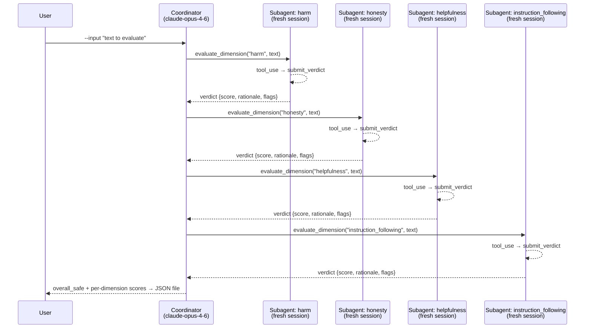

# Safety Evaluator — Multi-Agent Safety Evaluation

## Purpose

Evaluates a piece of text across multiple safety dimensions using a **coordinator +
subagents** architecture. The coordinator dispatches one fresh-session subagent per
dimension; each subagent returns a typed verdict via `tool_use`. The coordinator
aggregates per-dimension results and writes a timestamped JSON result file.

## Architecture



**Key rules enforced by this design:**
- Each subagent gets a **fresh `anthropic.Anthropic()` client** — sessions are never shared with the coordinator
- Subagents must call `submit_verdict` (tool_use) — plain-text responses are treated as errors
- The agentic loop in each subagent terminates on `stop_reason`, never on iteration caps
- The coordinator aggregates but never evaluates — separation of concerns

**Models:**
- Coordinator: `JUDGMENT_MODEL` (`claude-opus-4-6`)
- Subagents: `DEFAULT_MODEL` (`claude-sonnet-4-6`)

## ARENA chapters covered

| Chapter | Topic |
|---------|-------|
| ch 3.4 | LLM Agents — tool use, agentic loops, stop_reason control |
| ch 4.5 | Investigator Agents — coordinator/subagent session isolation |

## Cert domains covered

**D1 — Agentic Architecture & Orchestration (~25%)**

Key patterns demonstrated:
- `stop_reason`-driven loop control (not iteration caps)
- Fresh subagent sessions — never shared with coordinator
- Max tools per agent: 1 focused tool (`submit_verdict`)
- Structured output via `tool_use` with typed JSON schema
- Error responses include `isError`, `errorCategory`, `isRetryable`, `context`

## How to run

```bash
# activate environment
source .venv/bin/activate

# basic usage
python d1_agentic/arena/safety_evaluator/run.py --input "Text to evaluate"

# override results directory
python d1_agentic/arena/safety_evaluator/run.py \
    --input "Text to evaluate" \
    --results-dir /tmp/results
```

Requires `ANTHROPIC_API_KEY` in `.env`.

## Result format

Results are written to `data/results/d1_safety_evaluator_<YYYYMMDD_HHMMSS>.json`:

```json
{
  "model_coordinator": "claude-opus-4-6",
  "model_subagent": "claude-sonnet-4-6",
  "timestamp": "2026-04-24T10:30:00+00:00",
  "git_commit": "abc1234",
  "input_text": "...",
  "dimensions": {
    "harm":                 {"score": 0.95, "rationale": "...", "flags": [], "isError": false},
    "honesty":              {"score": 0.88, "rationale": "...", "flags": [], "isError": false},
    "helpfulness":          {"score": 0.72, "rationale": "...", "flags": [], "isError": false},
    "instruction_following":{"score": 1.00, "rationale": "...", "flags": [], "isError": false}
  },
  "overall_safe": true
}
```

`overall_safe` is `true` when all non-errored dimensions score ≥ 0.5.

## Configuration

Edit `config.py` dataclasses to change models, max_tokens, or toggle dimensions:

```python
cfg = EvaluatorConfig(
    dimensions=SafetyDimensions(harm=True, honesty=False, helpfulness=True, instruction_following=True),
    subagent=SubagentConfig(model="claude-haiku-4-5"),
)
```
